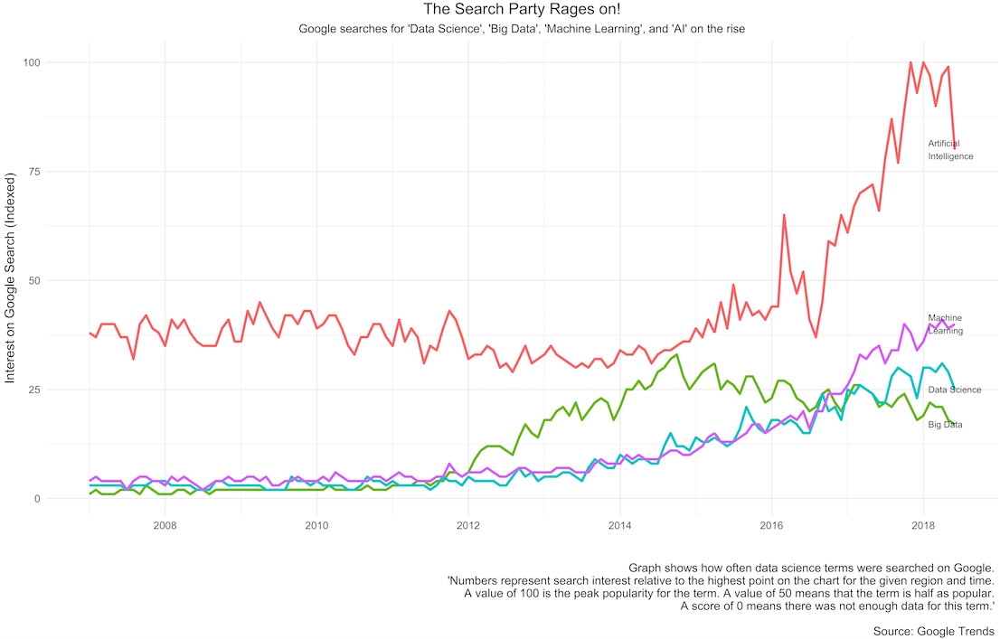

---
output:
  rmarkdown::html_document:
    theme: cerulean
  collapsed: no
  css: /css/style.css
subtitle: Part II - Data Science sounds made up
title: "| \\vspace{10cm} \\LARGE{} But what do you do, like really? \n| \\vspace{10cm}
  \\LARGE{}\n"
---

Brandon Dey
 

1.18.20

<!-- left indent like a bullet point-less bullet point -->

 
 

Recall we’re working out the answer to the question you never knew you wanted to know: why the hell doesn’t data science ring intuitively when my Dorkus friends tell me it’s how they put beer in their fridge? In [Part I](https://brandondey.github.io/writing/Da-heck-one), I chalked it up to three plausibilities: it sounds boring, it sounds made up, and the title doesn’t reveal what scientists of data actually do. I covered Part I [here](https://brandondey.github.io/writing/Da-heck-one), cover II below, and will cover III here. 

#### "Data science sounds made up"

And it is; but like how mathematics, computer science, and statistics were "made up" -- not like how fake news is. Data science was kind of aggressively whispered into existence in 1962 after [John W. Tukey](https://en.wikipedia.org/wiki/John_Tukey), a giant of both statistics and computer science — he coined the term "bit"^[A bit is a collection of 1’s and 0’s computers use to store information. 1 means yes, 0 no. Infinitely complicated pieces of information can be stored in large, Matrix-like grids of this binary. This is important to data scientists because we use computers for what computers are good at: processing sets of explicit, logical instructions quicker than people.] in 1947 —, published an article that was half rallying cry^[Tukey starts a number of sentences with “We [statisticians] need to face up to…” and finishes the piece with: “Who is for the challenge?”], half proof titled "The future of Data Analysis" in the The Annals of Mathematical Statistics. He argued the field of statistics wasn’t inclusive enough for the nature of their work anymore, and statisticians everywhere better loosen the heck up and advance their field already like the smarty pants’ in hard sciences like biochemistry did.

#### The Point:

Data science wasn’t just made up; it’s the 50+ year old intellectual offspring of computer science and statistics, emerging to solve new problems that existed because the rules of statistics no longer applied to data of increasing size, and so demanded the increased computational muscle of computer science. Now that it’s of age, data science has really gotten around, going to bed with the tools from a suite of scientific domains including ecology, epidemiology, computational linguistics, biology, and economics. 

** TWEAK START V **  

*****

#### Another Point

This looks like a data scientist is overextending the reach of data science to look cool. Maybe a little of that. But mostly this shows how data science is the junk drawer of Science. Associating data science to the capital S Science of the [Royal Society](https://en.wikipedia.org/wiki/Royal_Society)^[Technically they prefer their learned society moniker: “The President, Council and Fellows of the Royal Society of London for Improving Natural Knowledge”, but that’s just way too damn long for an in-paragraph citation.] might make an academic scientist scoff, data science being just “crass technology”^[Tukey did.]. But she can’t come to the phone right now because she’s writing a grant for her research that will take X long to be read by a single digit-sized audience.

**This one is up for debate since genomics work might be more the work of, oh I don’t know, genomics, and not data science. But on the pro data science side, lots of data scientists just cherry pick the techniques that work the best, not much minding what field they’re from, just so long as all the model assumptions jive with the application. Once we do that, it counts as a +1 for Team Data Science.**

** TWEAK END **

*****

#### The Point’s Point: 

This comprehensiveness poses another challenge for people whose ability to get the gist a subject is based on finding its well-defined boundaries. Data science is  
>"...defined by a ubiquitous problem rather than by a concrete subject."  *(John W. Tukey, p 6 of 'The Future of Data Analysis')*

#### Another Point:  

Data science might sound made up because it’s subsumed in a slurry of names like “machine learning”, “artificial intelligence”, and "predictive modeling"^[The media usually conflate all three into whatever delivers the largest dose of entertain-hem (entertainment + mayhem), which is usually AI. The differences between these come down to this, this, this, this, this, this, this, not this.]. 

#### The Final Point with Points Itself: 

The sheer range of subjects to which data science can -- and is being -- applied makes it real (cool), even if you’re not a technocrat from Community Dork.^[ Established [here](www.jds-online.com), circa January 2003.] 

Beyond the small walls of Community Dork lie vast regions of the economy reaping rewards from data science.

**affects everything**

#### The (Mid) Point:

The hard nuts data scientists are trying to crack are mostly cultural^[I'm conjecturing given that a culture’s rich info-trove eschews programmatic study because it’s pretty complex, or, aka: doesn’t fit into rows and columns nicely.]. Algorithm's are influencing culture. Think first of the physics and monetization of social networks on social media platforms LinkedIn, Twitter, and Facebook. Think second: art à la algorithm. 

*****

#### Machines Mold Movies, Music, Masses, & More

##### Social Physics
Alex Pentland of MIT is “principal geek” of a field called social physics, a new applied science about using knowledge about how ideas flow through social networks to drive behavior, and has assembled some of the most detailed datasets^[[See?](Http://realitycommons.media.mit.edu)] in the world on what he calls “living labs”, which are essentially what you’d get if you put a large glass box over a community and monitored everything you were interested in. 

**ADD STUFF**
- social media

##### Art à la Algorithm 

AI and machine learning techniques are being used to make what one could arguably^[This would be an intense debate. If art is one form of empathy and machines do/ca/n’t empathize, art by machines may be limited until they can -- or until they can convince us they can. This is a part of why their screenplays are wanky right now. Art, however, is much more than empathetic.] call art. 

The first screenplay — [a seven minute science fiction short](https://arstechnica.com/gaming/2016/06/an-ai-wrote-this-movie-and-its-strangely-moving/) — written by an “AI” named Benjamin came out in 2016. Its opening line is spoken by a character named H (Thomas Middleditch), who, wearing a shiny golden jacket, says, 

> “In a future with mass unemployment, young people are forced to sell blood. [brief pause] That’s something I could do.”  

What follows has nothing to do with this would-be conceit. In fact, most of the seven minutes is incoherent, even more so than most B-grade sci fi movies. However, the outro is a confession from another character named H2 (Elisabeth Gray) who, with tears trailing down face, laments:

> “He looks at me, and he throws me out of his eyes.”

Though the story is hard to follow  — it’s a concatenation of sci fi non-sequiturs — (so I therefore don’t know exactly how this matters in context...), her emotion in the poetic final moment does suggest some underlying plot in which the preceding events do matter because she’s been hurt, presumably by H^[Even though the whole plot up to this point painted the picture that H2 had hurt H, not H H2, so who the heck knows. Benjamin?]. This is, according to the novelist E.M. Forester, exactly what distinguishes mere story from plot: both cause *and* effect.^[By his definition a story is a mere collection of events, while plot answers ‘so what?’] 

#### The point:

Data science techniques are being harnessed to create what can arguably be called art, even if it is pretty lowbrow (and cheesy! Woof.) at this point.

There is at least one consulting firm out there helping elevate this lowbrow stuff up to a level of commercial feasibility, but notably not near highbrow height.^[**Disclaimer:** I know next to nothing on this right now, so my opinion is nowhere even close to being an authority on this topic. But my sense is that highbrow and commercial-level-brow are definitionally mutually exclusive.] The name’s [Epagogix](http://epagogix.com/about.html) and their team:

> “...helps [studio] management... by delivering accurate predictive analysis of the Box Office value of individual film scripts, and by identifying and quantifying how and where to improve their commercial value.”^[[Source](http://epagogix.com/about.html)] 

In addition to predicting blockbuster or budgetbusters, more interestingly Epagogix helps writers write movie scripts to maximize commercial success. 

> “If requested, Epagogix sensitively bridges the gap between the financial and creative aspects of film production by providing quantified insights and advice to those responsible for script development.” ^[IBID]

A similar model of reducing art — or what might be broadly defined as buyable beauty — to precise Euclidean-esque principles is used in the music industry to predict hit songs before they’re produced. In the words of Malcolm Gladwell from his compelling The New Yorker article on the issue, [“The Formula”](https://www.newyorker.com/magazine/2006/10/16/the-formula), a company called [Music Xray](https://www.musicxray.com/)^[Formerly Platinum Blue.]: 

>“...uses “spectral deconvolution software” to measure the mathematical relationships among all of a song’s structural components: melody, harmony, beat, tempo, rhythm, octave, pitch, chord progression, cadence, sonic brilliance, frequency, and so on. On the basis of that analysis, the firm believes it can predict whether a song is likely to become a hit with eighty-per-cent accuracy.”
 
So they predict hit songs by analyzing the underlying musical architecture, without much actual analytical attention applied to lyrics. For the artists and/or music purists in the audience, hearing that some music producers are literally making music by number might make you miff. I think what they’re doing is super cool, and even *I’m* a mite miffed that the artistic process is being bastardized by this kind of algorithmic commodification. The founders are aware of this, of course: “McCready stressed that his system didn’t take the art out of hit-making.”^[IBID. I’ll save my decomposition of art making for another post. I cite this because there’s a very old argument about what art is and if it can be reduced to a logical system of rules. I’m not sure. But I get the sense that it’s not automatically impossible expressly because “Art is art and logic is logic,” or something in that line of argument. It’s my impression that our tools just aren’t sophisticated enough to handle art’s complexity. Yet.]

On the other hand, there may be a kind — maybe the kind — of beauty buried in systematizing a subjective space through this sort of rational compression, which could reveal the principles others need to play with to produce more beauty. Yes, this already happens all the time as artists are inspired after seeing a nice-looking thing and want to make more nice-looking things. The algorithm just let’s producers make more money off the rules of a game many thought c/sh/ouldn’t be systematized.

> “It requires a very particular kind of person, of course, to see the world as a code waiting to be broken.”^[IBID]

#### The Point: 

Really any sector and company — public or private — that expects to be around in the future *should*^[Seriously. It’s a competitive advantage. [More](https://www.researchgate.net/publication/7327312_Competing_on_Analytics).]  use data science, but only companies profitable enough to afford a practice of their own usually do.^[ Except Toys R us, etc.]

#### Next Point: 

Data Science will continue to be siced on more complicated cultural problems. 

> “How is novelty most likely to begin and grow? Not through work on familiar problems.” (John W. Tukey p 4 of 'The Future of Data Analysis')

Even with gigs of media hype around “machine learning”, “big data”, and “Artificial Intelligence”, data science’s place in pop media is nascent. In fact, “Data Scientist” wasn’t even recognized as an occupation by the Bureau of Labor Statistics until 2018^[Data Scientist wasn’t in [BLS 2010 SOC](https://www.bls.gov/soc/soc_2010_definitions.pdf).]. And the data science fire didn’t catch the top of the Hill until 2015, when the first ^[[More](https://obamawhitehouse.archives.gov/blog/2015/02/18/white-house-names-dr-dj-patil-first-us-chief-data-scientist)] U.S. Chief Data Scientist, D.J. Patil, was appointed by the Obama Administration. Plus, so young in its infancy is data science that it’s still listed as college major of the future, says MSN Money^[[More](http://www.msn.com/en-us/money/careersandeducation/meet-the-future-with-these-7-college-majors/ss-AAxiFcO?li=BBnb7Kz&ocid=iehp#image=5).]. Therefore the field is aflame with opportunity, as demonstrated in this graph of Google searches for data-science-like terms. 

 

#### The Point:

> “Big data is like teenage sex: everyone talks about it, nobody really knows how to do it, everyone thinks everyone else is doing it, so everyone claims they are doing it” — Dan Ariely

**Expand on:  Data deluge. Data age. Information age. Lots to be said for this.**

Data science is awesome but there might be a downside too big to talk about here, so go forth and read: The Master Switch which documented the tendency of information technology to produce cartels and monopolies. It’s too simplistic to doom and gloom about our future being ravaged by SkyNet aware AI. **Yadda yadda**

